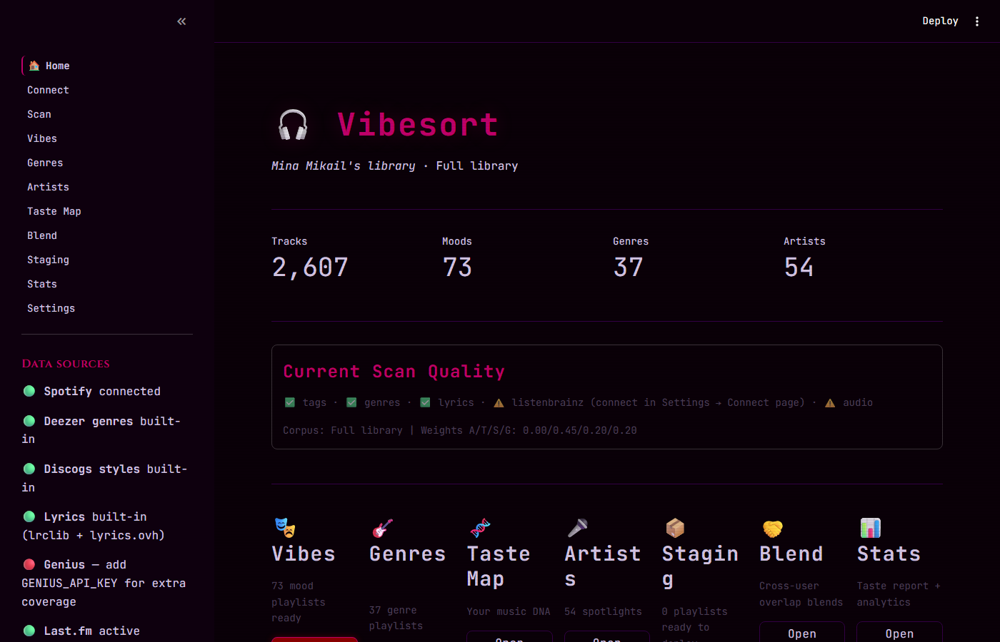
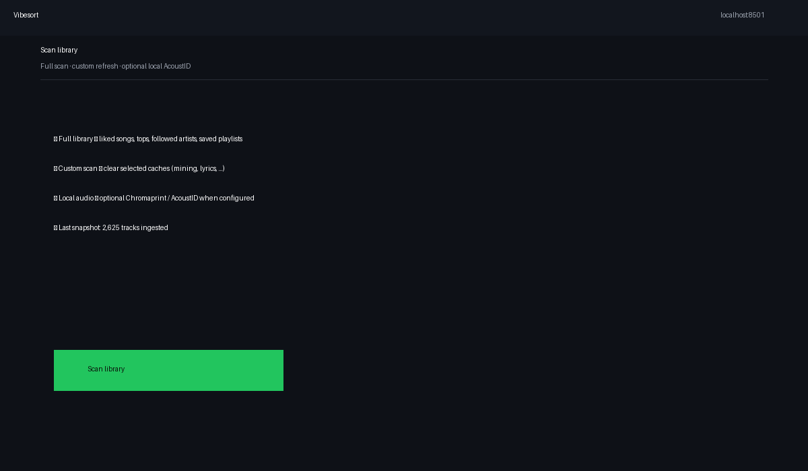
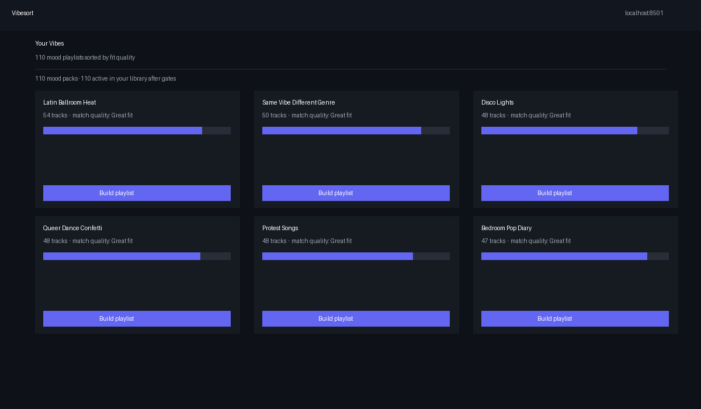
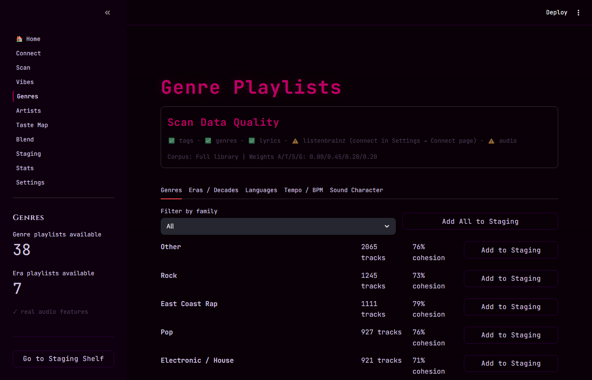
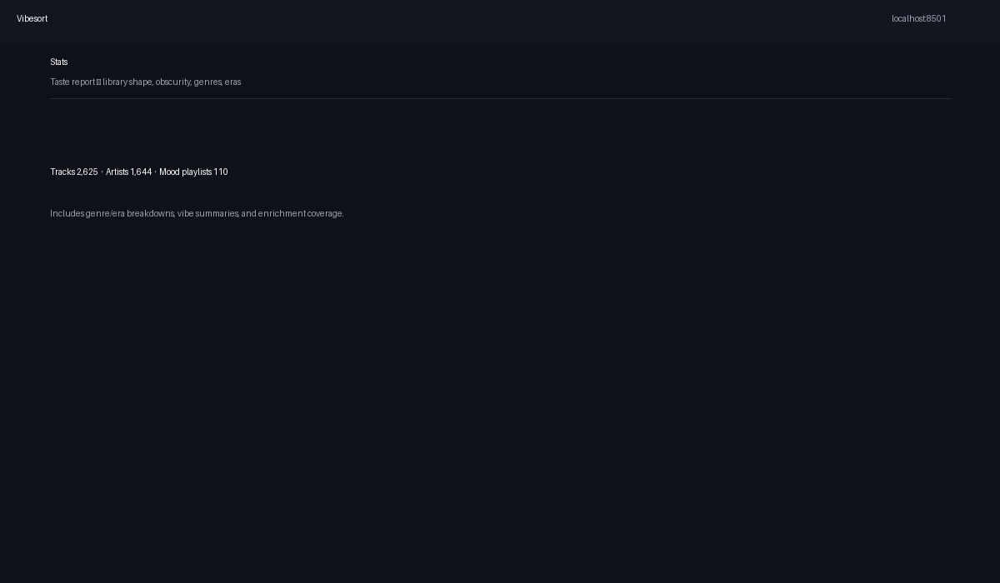

# Vibesort 🎧

> *Your music library, finally sorted by feeling.*

<p align="center">
  
</p>

You know that feeling when a song hits exactly right for the moment? Vibesort is built around that. It reads your Spotify library and sorts everything into **87 mood playlists** — not by BPM or energy level, but by what the music actually *feels* like. Hollow for 3am existential spirals. Villain Arc for when you need to feel unstoppable. Late Night Drive for exactly what it sounds like.

---

## Get started

**Windows:** double-click `run.bat`  
**Mac / Linux:** `bash run.sh`  
**Or:** `python launch.py` (Python 3.10+ required)

First launch installs dependencies and opens in your browser. Click **Connect to Spotify**, authorize, done.

Step-by-step install: **[SETUP.md](SETUP.md)**  
Full guide: **[docs/GUIDE.md](docs/GUIDE.md)**

> **Dev Mode note:** The shared app has a 25-user limit (Spotify policy). If you can't connect, use your own free Spotify developer app — takes 5 minutes: create an app at [developer.spotify.com](https://developer.spotify.com), add `https://papakoftes.github.io/VibeSort/callback.html` as a Redirect URI, paste the Client ID into Settings. No secret needed.

**Privacy:** Vibesort runs entirely on your machine. It reads your library and creates playlists you choose to deploy — it never modifies or deletes existing playlists, and no listening data leaves your computer.

---

## How it works

Vibesort uses a multi-signal scoring engine — not just one data source, but five layered together:

Vibesort layers five signals — tags (Last.fm, lyrics, Deezer, Discogs), semantic matching, genre hierarchy, and metadata proxy — weighted and combined per track. The result is playlists that feel right, not just sound similar.

**Spotify killed their audio-features API in late 2024.** Vibesort routes around it via three ground-truth pillars:
1. **87 curated mood anchors** — 3–5 hand-picked seed tracks per mood that inject the strongest possible signal when found in your library
2. **Last.fm similarity graph** — BFS propagation through your library using track similarity data
3. **Last.fm tag chart mining** — crowd-sourced mood tags from millions of listeners

---

## What you get

- **87 mood playlists** — Hollow, Villain Arc, Late Night Drive, Phonk Season, Rewire, Dissolve, and 81 more

<details>
<summary>See all mood categories</summary>

**Dark / Introspective:** Hollow · 3 AM Unsent Texts · Rainy Window · Smoke & Mirrors · Midnight Spiral · Heartbreak Hotel · Grief Sequence  
**Power / Energy:** Villain Arc · Rage Lift · Hard Reset · Adrenaline · Phonk Season · Drill Mode  
**Chill / Focus:** Late Night Drive · Lo-Fi Corner · Deep Focus · Sunday Reset · Golden Hour · Acoustic Corner  
**Party / Dance:** Afterparty · Hyperpop Overload · Rave Brain · Latin Heat · Queer Anthem  
**Story / Roots:** Nostalgia Rush · Bedroom Pop · Folk & Feel · Road Songs · Indie Daydream  
*…and 62 more across 87 total moods.*

</details>

- **42 genre playlists** — mapped with 500+ rules (East Coast Rap, UK Rap, Brazilian Phonk, Funk Carioca, etc.)
- **Era playlists** — by decade
- **Artist spotlights** — one playlist per artist with 8+ songs in your library
- **Emotional Fingerprint** — a visual breakdown of your library's emotional DNA (DARK / POWER / CHILL / PARTY / STORY)
- **Mood Atlas** — see all 87 moods and which ones are missing from your library (with discovery suggestions)
- **Taste Map** — explore your library's clusters visually
- **Staging shelf** — queue playlists, rename them, preview tracks, then batch-deploy to Spotify in one click
- **Blend** — multi-user blend, genre-aware, better than Spotify's (supports 3+ people)
- **Last.fm integration** — play history, personal listening anchors, time-of-day tags

---

## The flow

```
Connect to Spotify
    ↓
Scan Library  (~3–10 min first time, faster after)
    ↓
Browse Vibes · Genres · Artists
    ↓
Staging Shelf  (rename · preview · toggle recommendations)
    ↓
Deploy All → Spotify  (one click)
```

<p align="center">
  
</p>

---

## Optional: Last.fm

Add your key to `.env` for richer mood matching and personal anchor seeding:

```
LASTFM_API_KEY=your_key
LASTFM_API_SECRET=your_secret  
LASTFM_USERNAME=your_username
```

Free key at [last.fm/api](https://www.last.fm/api). With Last.fm connected, your most-played tracks get promoted to **personal anchors** — they pull their moods harder because the data proves you actually listen to them.

---

## Optional: your own Spotify app

```
VIBESORT_CLIENT_ID=your_client_id
SPOTIFY_CLIENT_ID=your_client_id
SPOTIFY_CLIENT_SECRET=your_client_secret
```

Register `https://papakoftes.github.io/VibeSort/callback.html` as your redirect URI.

---

## Project layout

```
Vibesort/
├── app.py              Home + routing
├── config.py           Settings (.env)
├── launch.py           Entrypoint
├── run.bat / run.sh    User launchers
│
├── pages/              Streamlit UI (Connect, Scan, Vibes, Genres, …)
├── core/               Scoring engine, enrichers, integrations
├── staging/            Playlist staging + deploy
├── tests/              60+ unit tests + audit script
│
└── data/
    ├── packs.json          87 mood definitions
    ├── mood_anchors.json   361 curated seed tracks
    └── macro_genres.json   Genre mapping rules
```

---

## Requirements

- Python 3.10+
- Free Spotify account
- Optional: Last.fm account

---

## Contributing

PRs welcome. Good places to start:
- New mood packs in `data/packs.json`
- Better genre rules in `data/macro_genres.json`
- Improved playlist naming in `core/namer.py`
- UI improvements in `pages/`

---

<p align="center">
  
</p>

<p align="center">
  
  
</p>

---

## Related tools

| Tool | What it adds |
|------|-------------|
| [Last.fm](https://last.fm) | Permanent scrobble history |
| [stats.fm](https://stats.fm) | Full play history |
| [Every Noise at Once](https://everynoise.com) | Spotify's map of ~6000 genres |
| [Obscurify](https://obscurify.com) | Obscurity score |
| [Soundiiz](https://soundiiz.com) | Transfer playlists between platforms |

---

## About

Vibesort started as a personal tool — a way to properly sort a music library that had grown too big to navigate by feel alone. The impetus was a friend whose musical taste was too specific and too good to be served by Spotify's algorithmic playlists.

If your library has moods that Spotify's recommendations never quite catch — this was built for that.
