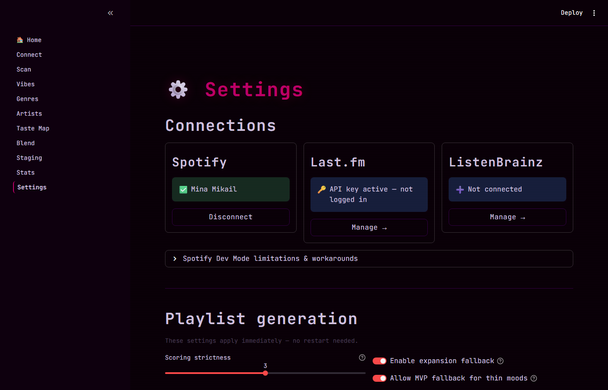
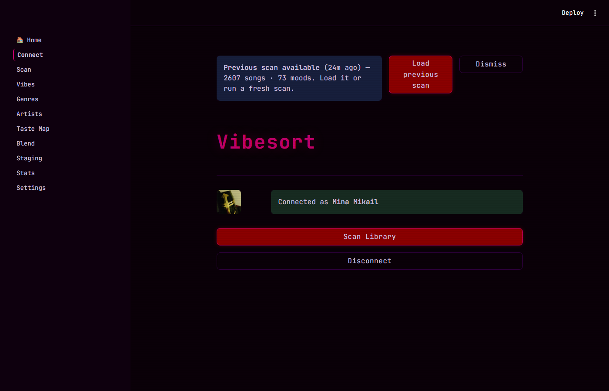

# Vibesort

**Your Spotify library, sorted by feeling.**

<p align="center">
  
</p>

Vibesort scans your liked songs, top tracks, and saved playlists — then groups them into mood, genre, era, and artist playlists using a multi-signal scoring engine that combines tags, semantic similarity, genre structure, and real-world human labeling from public Spotify playlists.

---

## Quick start

New to Vibesort? Read the **[Getting Started Guide](docs/GUIDE.md)** — covers everything from install to deploying your first playlists.

Step-by-step install for Windows, Mac, and Linux (no Git required): **[SETUP.md](SETUP.md)**.

Repository layout and legacy scripts: **[docs/REPO_LAYOUT.md](docs/REPO_LAYOUT.md)**.  
**Share with friends (no Python on their PC):** build a portable zip — **[docs/PACKAGING.md](docs/PACKAGING.md)**  
(`pwsh` or `powershell -File scripts\build_portable.ps1` → send `dist\Vibesort-Windows-portable.zip`)

- **Windows:** double-click `run.bat`
- **Mac / Linux:** `bash run.sh`

First launch installs dependencies and opens the app in your browser.

---

## Why it exists

Most tools sort by audio features alone (energy, tempo, valence). The problem: that gives you playlists that *sound* similar but don't *feel* similar. Dark phonk and sad indie can share identical audio fingerprints but hit completely differently.

Spotify removed the public audio-features API in late 2024. Vibesort uses **metadata-derived proxy** audio vectors (tags, genres, BPM heuristics) with tunable weight **`W_METADATA_AUDIO`** alongside tags, semantic, and genre layers. Defaults (see `config.py` / `.env`):

| Signal | Default weight | Source |
|---|---|---|
| Tags | 48% | Playlist mining, Last.fm, AudioDB, Discogs, lyrics keywords, etc. |
| Semantic | 22% | Abstract meaning layer in the scorer |
| Genre | 20% | 42-genre hierarchy from artist tags + enrichers |
| Metadata audio | 10% | Proxy energy/valence/tempo from tags + genres (not Spotify-measured) |

The playlist mining step is the key: it searches public playlists named things like "late night drive", "gym rage", "overthinking" — checks which of your songs appear in them — and uses that as a human-labeled signal. This is how real music systems work.

---

## Features

- **87 mood presets** — Late Night Drive, Villain Arc, Phonk Season, Dissolve, Rewire, and many more (see `data/packs.json`)
- **42-genre hierarchy** — East Coast Rap, West Coast Rap, Southern Rap, Houston Rap, Midwest Rap, UK Rap, French Rap, Brazilian Phonk, Funk Carioca, and many more — mapped with 500+ rules
- **Three naming engines** — Middle-out (smart hybrid, default), Top-down (preset labels), Bottom-up (named from actual content)
- **Staging shelf** — build up a list of playlists, rename them, preview tracklists, then batch-deploy to Spotify in one click
- **Recommendations** — Spotify-suggested similar songs optionally added to any playlist
- **Genre playlists** — sorted by your library's actual genre breakdown
- **Era playlists** — by decade
- **Artist spotlights** — one playlist per artist with 8+ songs in your library
- **Language playlists** — group songs by detected language
- **Blend** — multi-user blend (supports 3+ people, genre-aware, multiple angles — better than Spotify's Blend)
- **Last.fm integration** — optional, adds full play history and listening stats
- **Taste Map** — explore library clusters in the UI
- **Taste report** — obscurity score, audio fingerprint, genre breakdown, top vibes
- **Settings** — API keys and optional enrichers (Discogs, lyrics, etc.)
- **Full Spotify data export** — drop your `StreamingHistory_music_*.json` files into `data/` for complete history

---

## Setup

See **[SETUP.md](SETUP.md)** for a full walkthrough (Python install, ZIP download, PATH on Windows).

**Windows** — double-click `run.bat`  
**Mac / Linux** — `bash run.sh`  
**Or:** `python launch.py` (after Python 3.10+ is installed)

No Spotify developer account is required for the default shared app. First run installs dependencies, then the browser opens. Click **Connect to Spotify**, authorize, done.

> **Note:** The app is currently in Spotify Development Mode (25-user limit). If you can't connect, [open an issue](https://github.com/PapaKoftes/VibeSort/issues) to be added to the allowlist.

---

### Advanced: use your own Spotify app

If you want to run Vibesort with your own Spotify developer credentials, add them to `.env`:
```
VIBESORT_CLIENT_ID=your_client_id
SPOTIFY_CLIENT_ID=your_client_id
SPOTIFY_CLIENT_SECRET=your_client_secret
```
And register `https://papakoftes.github.io/VibeSort/callback.html` as your app's redirect URI.

---

## The flow

```
Connect to Spotify
    ↓
Scan Library  (~1–3 min first time, cached after)
    ↓
Browse Vibes / Genres / Artists
    ↓
Add playlists to Staging Shelf
Rename them · toggle recommendations · preview tracks
    ↓
Deploy All to Spotify  (one click)
```

<p align="center">
  
</p>

---

## Mood presets (87 total)

All vibe names, descriptions, and scoring hints live in [`data/packs.json`](data/packs.json) under `moods`. After you **Scan Library**, open **Vibes** in the app to browse and stage playlists.

<p align="center">
  
</p>

---

## Full listening history (optional)

Spotify's API only exposes your top 50 tracks per time window. To unlock your complete all-time history:

1. Go to [spotify.com/account/privacy](https://www.spotify.com/account/privacy/)
2. Request **Extended streaming history** (takes up to 30 days)
3. Drop the `StreamingHistory_music_*.json` files into `data/`

See `data/HOW_TO_GET_FULL_HISTORY.md` for full steps.

---

## Last.fm (optional)

Add your Last.fm credentials to `.env` to pull full scrobble history and listening stats:
```
LASTFM_API_KEY=your_key
LASTFM_API_SECRET=your_secret
LASTFM_USERNAME=your_username
```

Get a free API key at [last.fm/api](https://www.last.fm/api).

---

## Project structure

```
Vibesort/
├── app.py                      Streamlit home + sidebar navigation
├── config.py                   Settings (from .env)
├── launch.py                   Dependency check, then Streamlit
├── run.bat / run.sh            User entrypoints
├── run.py                      CLI / interactive menu (optional)
├── requirements.txt
├── .env.example
├── scripts/                    Portable Windows build (see docs/PACKAGING.md)
│
├── pages/                      Streamlit multipage UI (Connect, Scan, Vibes, …)
├── core/                       Ingest, scan_pipeline, enrich, scoring, deploy,
│                               integrations (Spotify, Last.fm, Discogs, lyrics, …)
├── staging/                    Staging shelf + deploy helpers
├── tests/                      Pytest
│
└── data/
    ├── packs.json              Mood preset definitions (87 moods)
    ├── macro_genres.json       Genre normalization rules
    └── HOW_TO_GET_FULL_HISTORY.md
```

---

## Screenshots

<p align="center">
  
  
</p>
<p align="center">
  
  
</p>

---

## Complementary tools

| Tool | What it adds |
|---|---|
| [stats.fm](https://stats.fm) | Full play history, year-round Wrapped |
| [Every Noise at Once](https://everynoise.com) | Spotify's map of ~6000 genres |
| [Obscurify](https://obscurify.com) | Obscurity score + genre map |
| [Receiptify](https://receiptify.herokuapp.com) | Top tracks as a shareable receipt |
| [Icebergify](https://icebergify.com) | Mainstream → obscure iceberg chart |
| [Soundiiz](https://soundiiz.com) | Transfer playlists to other platforms |
| [Last.fm](https://last.fm) | Permanent scrobble history |

---

## Requirements

- Python 3.10+
- Free Spotify account + free Spotify Developer app (5 min setup)
- Optional: Last.fm account for extended history

---

## Contributing

PRs welcome. Good places to start:

- New mood packs in `data/packs.json` (`moods`) — follow the existing structure
- Better genre rules in `data/macro_genres.json` — more specific rules go higher up
- Improved playlist naming in `core/namer.py`
- UI improvements in `pages/`
