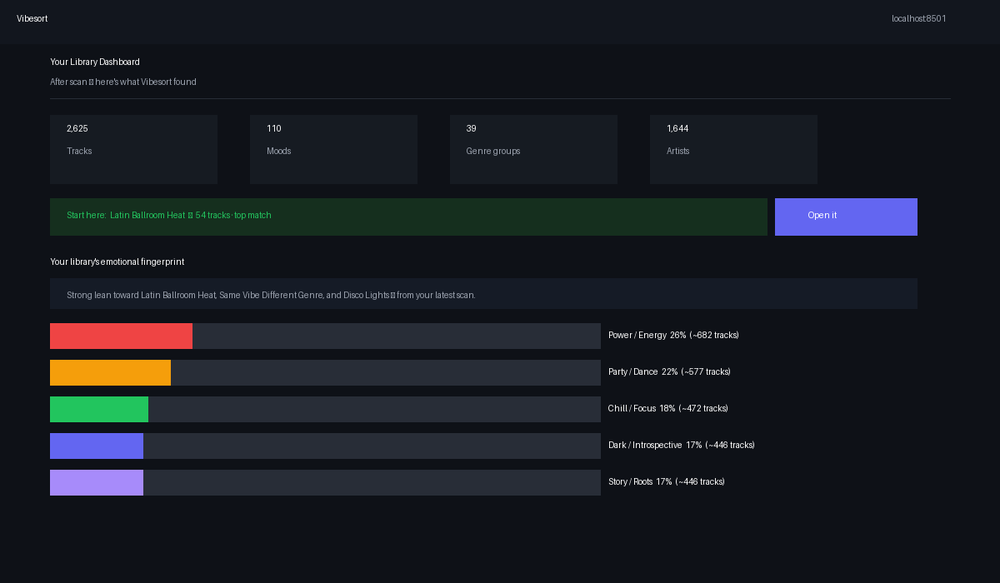
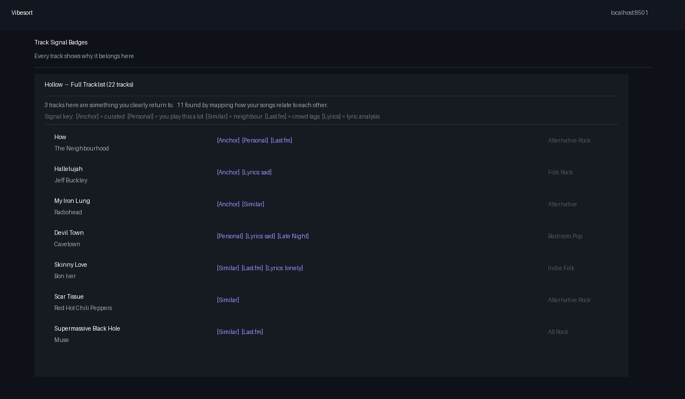
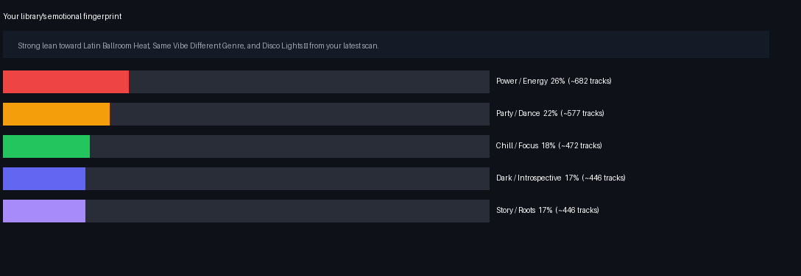
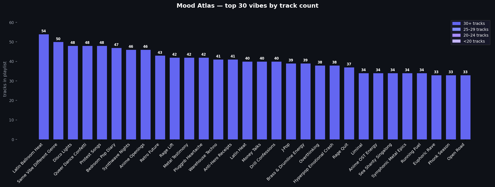

# Vibesort 🎧

> *Your music library, finally sorted by feeling.*

<p align="center">
  
</p>

You know that feeling when a song hits exactly right for the moment? Vibesort is built around that. It reads your Spotify library and sorts everything into **110 mood playlists** — not by BPM or energy level, but by what the music actually *feels* like. Hollow for 3am existential spirals. Villain Arc for when you need to feel unstoppable. Late Night Drive for exactly what it sounds like.

---

## Get started

**Windows:** double-click `run.bat`  
**Mac:** double-click `Vibesort.command` in Finder, or `bash run.sh` in Terminal  
**Linux:** `bash run.sh`  
**Or:** `python launch.py` (Python 3.10+ required)

First launch installs dependencies and opens in your browser. Click **Connect to Spotify**, authorize, done.

Step-by-step install: **[SETUP.md](SETUP.md)**  
Full guide: **[docs/GUIDE.md](docs/GUIDE.md)**

> **Dev Mode note:** The shared app has a 25-user limit (Spotify policy). If you can't connect, use your own free Spotify developer app — takes 5 minutes: create an app at [developer.spotify.com](https://developer.spotify.com), add `https://papakoftes.github.io/VibeSort/callback.html` as a Redirect URI, paste the Client ID into Settings. No secret needed.

**Privacy:** Vibesort runs entirely on your machine. It reads your library and creates playlists you choose to deploy — it never modifies or deletes existing playlists, and no listening data leaves your computer.

---

## What you get

- **110 mood playlists** — Hollow, Villain Arc, Late Night Drive, Phonk Season, Rewire, Dissolve, and 104 more

<details>
<summary>See all mood categories</summary>

**Dark / Introspective:** Hollow · 3 AM Unsent Texts · Rainy Window · Smoke & Mirrors · Midnight Spiral · Heartbreak Hotel · Grief Sequence · Grief Wave · Winter Dark · Bedroom Confessions · Sea of Feels  
**Power / Energy:** Villain Arc · Rage Lift · Hard Reset · Adrenaline · Phonk Season · Drill Mode · Boxing Ring · Rage Quit · Running Fuel · Breakup Bravado  
**Chill / Focus:** Late Night Drive · Lo-Fi Corner · Deep Focus · Sunday Reset · Golden Hour · Acoustic Corner · Coffee Shop Folk · Work Mode · Morning Coffee · Acoustic Soul  
**Party / Dance:** Afterparty · Hyperpop Overload · Rave Brain · Latin Heat · Queer Anthem · Club Warm-Up · Dance Alone · Trap & Chill · New City Energy  
**Story / Roots:** Nostalgia Rush · Bedroom Pop · Folk & Feel · Road Songs · Indie Daydream · Campfire Sessions · Protest Songs · Piano Bar · Midnight Gospel  
**Cinematic / Expansive:** Cinematic Swell · Retro Future · Epic Gaming · Tenderness  
*…and more across 110 total moods.*

</details>

- **42 genre playlists** — mapped with 691 rules (East Coast Rap, UK Rap, Brazilian Phonk, Funk Carioca, etc.)
- **Era playlists** — by decade
- **Artist spotlights** — one playlist per artist with 8+ songs in your library
- **Emotional Fingerprint** — a visual breakdown of your library's emotional DNA (DARK / POWER / CHILL / PARTY / STORY)
- **Mood Atlas** — see all 110 moods and which ones are missing from your library (with discovery suggestions)
- **Taste Map** — your library's emotional clusters visualised
- **Staging shelf** — queue playlists, rename them, preview tracks, then batch-deploy to Spotify in one click
- **Blend** — multi-user mood blend (supports 3+ people, better than Spotify's)
- **Last.fm integration** — play history, personal listening anchors, time-of-day tags

---

## The flow

```
Connect to Spotify
    ↓
Scan Library  (~3–10 min first time, faster after)
    ↓
Browse Vibes · Genres · Artists
    ↓
Staging Shelf  (rename · preview · toggle recommendations)
    ↓
Deploy All → Spotify  (one click)
```

<p align="center">
  
</p>

---

## How it's built

Spotify killed their audio-features API in late 2024. Every tool that relied on danceability/energy/valence scores broke overnight. Vibesort routes around it.

Instead of one data source, it layers five signals per track and weights them:

| Signal | Source | Weight |
|--------|--------|--------|
| Mood tags | Last.fm, Deezer, Discogs, lyrics (VADER sentiment) | 0.45 |
| Semantic similarity | Sentence-transformer embeddings of mood descriptions vs track metadata | 0.22 |
| Genre match | 691-rule genre hierarchy, matched against Spotify artist genres | 0.18 |
| Audio proxy | Metadata-derived BPM/energy estimates (Deezer, track duration, key signals) | 0.15 |

The anchor system is the core of why it works: **1,679 hand-curated seed tracks** across 110 moods. When an anchor track is found in your library, it becomes a strong directional signal — the scoring engine uses it to pull similar tracks toward that mood. It's the difference between a model that guesses and one that knows what "Hollow" actually sounds like.

On top of that:
- **Graph propagation** — Last.fm similarity BFS spreads mood labels through your library from anchor seeds
- **Chart mining** — Last.fm tag charts inject crowd-sourced mood tags without needing Spotify's playlist API
- **Multilingual support** — `paraphrase-multilingual-MiniLM-L12-v2` handles 50+ languages; Arabic, Hindi, German, Turkish, Japanese libraries all work
- **PKCE auth** — no backend server, no user secrets stored anywhere, fully client-side OAuth

<p align="center">
  
  
</p>

<p align="center">
  
</p>

<p align="center">
  
</p>

---

## Optional: Last.fm

Strongly recommended — adds personal listening history as anchors and enables chart-based tag injection:

```
LASTFM_API_KEY=your_key
LASTFM_API_SECRET=your_secret
LASTFM_USERNAME=your_username
```

Free key at [last.fm/api](https://www.last.fm/api). With Last.fm connected, your most-played tracks become **personal anchors** — they pull their moods harder because the data proves you actually listen to them.

---

## Optional: your own Spotify app

If the shared app's 25-user Dev Mode limit is a problem, use your own:

```
VIBESORT_CLIENT_ID=your_client_id
```

Register `https://papakoftes.github.io/VibeSort/callback.html` as your redirect URI. PKCE — no secret needed.

---

## Project layout

```
Vibesort/
├── app.py              Home + routing
├── config.py           Settings (.env)
├── launch.py           Entrypoint
├── run.bat / run.sh    One-click launchers
│
├── pages/              10-page Streamlit UI
│   ├── 1_Connect.py    Spotify + Last.fm auth
│   ├── 2_Scan.py       Library scan + progress
│   ├── 3_Vibes.py      Mood playlist browser
│   ├── 4_Genres.py     Genre playlists
│   ├── 5_Artists.py    Artist spotlights
│   ├── 6_Blend.py      Multi-user blend
│   ├── 7_Taste_Map.py  Music DNA visualisation
│   ├── 8_Staging.py    Queue + deploy
│   ├── 9_Stats.py      Taste report + stats
│   └── 10_Settings.py  Config + custom builder
│
├── core/               Scoring engine + enrichers
│   ├── scan_pipeline.py  Full ingest → tag → score → playlist pipeline
│   ├── scorer.py         Multi-signal weighted scoring
│   ├── semantic_embed.py Multilingual sentence embeddings
│   ├── lastfm.py         Last.fm API + graph propagation
│   ├── mood_graph.py     BFS similarity graph
│   ├── enrich.py         Deezer / Discogs / AudioDB enrichment
│   └── deploy.py         Spotify playlist creation
│
├── staging/            Staging shelf (disk-backed playlist queue)
├── tests/              111 unit tests + audit script
│
└── data/
    ├── packs.json          110 mood definitions + vibe sentences
    ├── mood_anchors.json   1,679 curated seed tracks (110 moods)
    ├── mood_lastfm_tags.json  Last.fm tag vocabulary per mood
    └── macro_genres.json   691-rule genre mapping
```

---

## Requirements

- Python 3.10+
- Free Spotify account
- Optional: Last.fm account (strongly recommended)

---

## Contributing

PRs welcome. Good places to start:
- New mood packs in `data/packs.json`
- Better genre rules in `data/macro_genres.json`
- Improved playlist naming in `core/namer.py`
- UI improvements in `pages/`

---

## About

Vibesort started as a personal tool — a way to properly sort a music library that had grown too big to navigate by feel alone. The impetus was a friend whose musical taste was too specific and too good to be served by Spotify's algorithmic playlists.

The Spotify API situation forced the interesting architecture: when they killed audio features, the project had to actually think about *why* certain music feels the way it does — which led to the anchor system, the semantic embeddings, the hand-curation. It ended up being a better answer than the original float-based one anyway.

If your library has moods that Spotify's recommendations never quite catch — this was built for that.

---

## License

[MIT](LICENSE)
