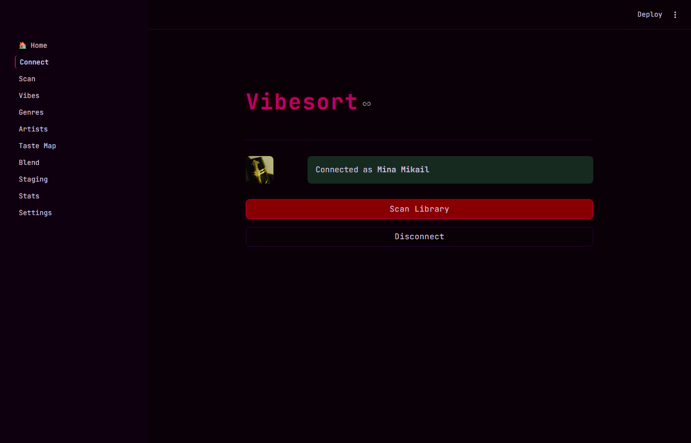
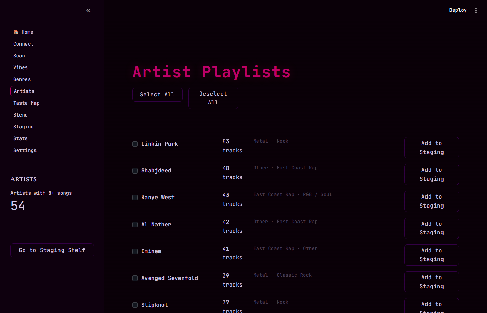
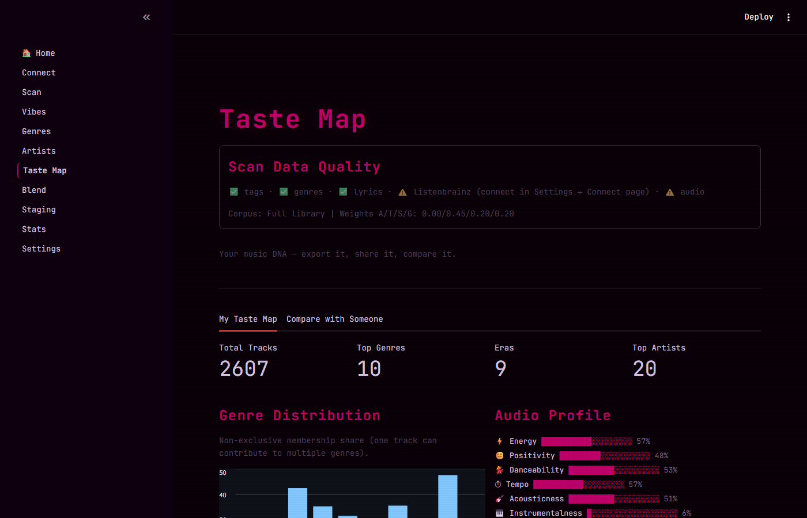
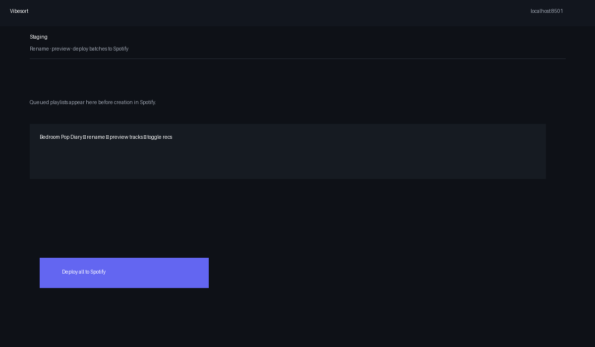

# Vibesort — Getting Started Guide

> **New here?** This document walks you through everything from first launch to deploying your first playlists to Spotify.

---

## What is Vibesort?

Vibesort is a local app that scans your Spotify library and organizes it into playlists by **mood, genre, era, and artist** — using a multi-signal scoring engine rather than raw audio features. The core insight: a song's *feel* comes from tags, genre context, lyric themes, and how real humans playlist it, not just its BPM or energy level.

All processing happens on your machine. Nothing is sent to a server.

---

## 1. Installation

### Windows

1. Download or clone this repository
2. Double-click **`run.bat`**

That's it. On first launch it checks for Python 3.10+, installs all Python dependencies, and opens the app in your browser. If Python isn't installed, it opens the download page for you.

### Mac

Double-click **`Vibesort.command`** in Finder. If macOS blocks it: right-click → Open → Open anyway (one-time only).

Or in Terminal:

```bash
bash run.sh
```

### Linux

```bash
bash run.sh
```

Same auto-setup behavior on all platforms.

### Manual

```bash
python launch.py
```

---

## 2. Connect to Spotify

When the app opens, you'll land on the **Connect** page.

<p align="center">
  
</p>

Click **Connect to Spotify**. Your browser will open Spotify's authorization page. Log in, click **Agree**, and you'll be redirected back. The app reads your token automatically — no copy-pasting.

> **Dev Mode note:** The shared app has a 25-user limit (Spotify policy). If you see "access denied", use your own free Spotify developer app: create one at [developer.spotify.com](https://developer.spotify.com), add `https://papakoftes.github.io/VibeSort/callback.html` as a Redirect URI, and paste the Client ID into the Settings page. No client secret needed.

---

## 3. Scan Your Library

Go to **Scan** in the sidebar (or click the button on the Connect page).

<p align="center">
  
</p>

**Scan modes:**
- **Full library** — liked songs, top tracks, followed artists, saved playlists
- **Custom scan** — refresh selected enrichment caches only (mining, lyrics, Last.fm, …)
- **Local audio** — optional Chromaprint / AcoustID fingerprinting for files under `LOCAL_MUSIC_PATH`

Click **Scan Library**. The first scan takes **3–15 minutes** depending on library size and which enrichment sources are enabled. It:
1. Fetches your tracks from Spotify
2. Pulls genre and mood tags from Last.fm, Deezer, Discogs, MusicBrainz, and lyrics
3. Mines public Spotify playlists where the API permits (Development Mode may restrict this; other sources backfill)
4. Builds a per-track profile combining genres, tags, lyrics, and audio proxy signals — Spotify's audio-features endpoint was deprecated in November 2024 and is no longer used
5. Runs each track through **110** mood scorers (see `data/packs.json`)
6. Writes caches under `outputs/` so re-scans are much faster

After scanning, the results are cached — future launches load in under a second.

---

## 4. Browse Your Vibes

Open **Vibes** in the sidebar.

<p align="center">
  
</p>

You'll see mood playlist cards sorted by match quality (how strongly your tracks fit that vibe). Each card shows:
- The mood name and description
- Track count + match quality label (Perfect fit / Great fit / Good fit / Mixed / Broad)
- Signal badges for each track: **[Anchor]** curated seed · **[Personal]** your play history · **[Similar]** graph propagation · **[Last.fm]** crowd tags · **[Lyrics]** lyric sentiment
- Insight lines: how many tracks you personally return to, how many were found via similarity graph

**Filter** by tag (e.g. `dark`, `lo-fi`, `rap`) or sort by match quality/size.

Click **Build Playlist** on a card to stage that mood for review, then open **Staging** to rename, preview, and deploy.

---

## 5. Browse by Genre, Artist, or Era

The sidebar has dedicated pages for each dimension.

### Genres

<p align="center">
  
</p>

42-genre hierarchy (East Coast Rap, Synthwave, Folk/Americana, etc.) plus era, language, tempo, and sound-character views. The **Scan Data Quality** badge at the top shows which signal layers are active for this scan. Each row shows track count and cohesion score.

### Artists

<p align="center">
  
</p>

One playlist per artist with 8+ songs in your library, sorted by track count. Each row shows genre labels so you can spot your heaviest-listened genre pools at a glance.

### Taste Map

<p align="center">
  
</p>

Your library's emotional DNA: genre distribution chart, audio profile (energy, positivity, danceability, tempo, acousticness, instrumentalness), top artists, and eras. The **Compare with Someone** tab lets you paste a second user's export to see how libraries overlap.

---

## 6. Staging (playlist queue)

<p align="center">
  
</p>

**Staging** is your shelf before playlists exist in Spotify. Here you can:
- **Rename** any playlist before it's created
- **Preview** the full tracklist
- Toggle **Expand with similar songs** — pads the playlist with tracks from Last.fm `track.getSimilar` that match the mood (requires a Last.fm API key)
- Remove playlists you've changed your mind about
- Click **Deploy All** to create everything in one shot

Deployed playlists appear in your Spotify account immediately.

> **Recommendations note:** Spotify's `/v1/recommendations` endpoint was deprecated November 2024. Similar-song expansion now uses Last.fm `track.getSimilar` — it works in any Spotify mode (Dev Mode and Extended Quota) and requires no Spotify quota upgrade. Add `LASTFM_API_KEY=your_key` to your `.env` file if not already configured.

---

## 7. Your Taste Report

Open **Stats** to see a breakdown of your library.

Includes:
- Track count, unique artists, genres, eras, moods detected
- **Obscurity score** (0–100, higher = more underground)
- Genre breakdown chart
- Era distribution
- Top detected moods and their cohesion
- **Audio profile** — energy, valence, danceability, tempo, acousticness, instrumentalness derived from the metadata proxy (Deezer BPM/gain + genre heuristics; Spotify audio features are not used)
- Top artists by library count
- Vibe tag cloud
- Enrichment coverage (signal layers active per track)

---

## 8. Optional Enrichment

### Last.fm

Adds your full scrobble history as a listening-weight signal, enables chart-based mood tag injection, and powers similar-song recommendations. Go to **Connect** and enter your Last.fm username (no API key needed for history — the app ships with a shared key; for full recommendations support add your own key in Settings).

### ListenBrainz

Open-source scrobble history. Same flow: go to **Connect**, paste your ListenBrainz token and username.

### Full Spotify History

Spotify's API only returns your top 50 tracks per time window. To unlock your *complete* all-time play history:

1. Go to [spotify.com/account/privacy](https://www.spotify.com/account/privacy/)
2. Request **Extended streaming history** (takes up to 30 days to receive)
3. Drop the `StreamingHistory_music_*.json` files into the `data/` folder
4. Launch Vibesort and run **Scan Library** — the files are picked up automatically

### Discogs

Adds genre and style tags from Discogs releases. Enable in **Settings → Enrichment**.

---

## 9. Settings Reference

Open **Settings** in the sidebar.

| Section | What it controls |
|---|---|
| **Connections** | Spotify app override (Client ID), Last.fm API key, ListenBrainz token |
| **Playlist generation** | Scoring strictness, expansion fallback, MVP mood filter, minimum totals |
| **Enrichment** | Toggle AudioDB, Discogs, lyrics, MusicBrainz, Musixmatch |
| **Caching** | Clear per-source caches or reset the full scan snapshot |
| **Dev Mode info** | Table of deprecated Spotify endpoints and their working replacements |
| **.env template** | Copy a starter config file for manual setup |

---

## 10. Blend (Multi-user)

The **Blend** page lets multiple people merge their libraries for a shared playlist. Supports 3+ users, genre-aware weighting, and multiple angles (shared taste vs. compromise vs. discovery). Each user connects their own Spotify account.

---

## Troubleshooting

| Problem | Fix |
|---|---|
| "Please connect to Spotify first" on all pages | Go to Connect and click **Connect to Spotify** |
| Scan hangs at playlist mining | Normal — enrichment can take several minutes on first scan. Subsequent scans use cache and are much faster. |
| Too many songs in "Other" genre | Re-scan after adding Last.fm or genre tags — the backfill improves classification |
| App won't start (Windows) | Make sure Python 3.10+ is on PATH and `run.bat` was used |
| Port 8501 already in use | Another Streamlit app is running. Close it or set `STREAMLIT_PORT` in `.env` |
| Spotify "access denied" | The shared app has a 25-user limit. Use your own free Spotify developer app — takes 5 minutes. See the Connect page for instructions. |
| "Expand with similar songs" adds nothing | Add `LASTFM_API_KEY=your_key` to your `.env` file (free key at [last.fm/api](https://www.last.fm/api/account/create)) |

---

## File Layout Reference

```
Vibesort/
├── run.bat / run.sh         Double-click to launch
├── launch.py                Dependency check + Streamlit starter
├── app.py                   Sidebar + home page
├── config.py                All settings (reads from .env)
│
├── pages/
│   ├── 1_Connect.py         Spotify / Last.fm / ListenBrainz auth
│   ├── 2_Scan.py            Library scan trigger + progress
│   ├── 3_Vibes.py           Mood playlist browser
│   ├── 4_Genres.py          Genre / era / language / tempo playlists
│   ├── 5_Artists.py         Artist playlist browser
│   ├── 6_Blend.py           Multi-user mood blend
│   ├── 7_Taste_Map.py       Music DNA + library comparison
│   ├── 8_Staging.py         Rename, preview, expand, deploy
│   ├── 9_Stats.py           Taste report + enrichment coverage
│   └── 10_Settings.py       API keys, scoring weights, cache control
│
├── core/
│   ├── scan_pipeline.py     Orchestrates the full scan
│   ├── scorer.py            Multi-signal mood scoring engine
│   ├── semantic_embed.py    Multilingual sentence embeddings
│   ├── audio_proxy.py       Metadata-derived audio proxy (Deezer BPM/gain, genre heuristics)
│   ├── lastfm.py            Last.fm tags, graph propagation, similar-track lookup
│   ├── recommend.py         Recommendations via Last.fm getSimilar + Spotify search
│   ├── mood_graph.py        BFS similarity graph
│   ├── enrich.py            Artist genre enrichment (Spotify + search fallback)
│   ├── profile.py           Per-track signal profiles
│   ├── genre.py             Genre normalisation (42 macro genres)
│   ├── namer.py             Playlist name + description generation
│   ├── deploy.py            Spotify playlist creation
│   └── theme.py             App CSS / design tokens
│
├── staging/                 Disk-backed playlist queue
├── tests/                   Unit tests + audit script
│
└── data/
    ├── packs.json           110 mood preset definitions
    ├── mood_anchors.json    1,679 curated seed tracks
    ├── mood_lastfm_tags.json  Last.fm tag vocabulary per mood
    ├── macro_genres.json    691-rule genre normalisation
    └── HOW_TO_GET_FULL_HISTORY.md
```

---

## Contributing

- **New moods** — add entries to `data/packs.json` under `"moods"`. Follow the existing structure (name, description, semantic_core, tags, genre_hints, audio_hint).
- **Better genre rules** — edit `data/macro_genres.json`. More specific rules go higher in the list (first match wins).
- **Bug reports** — open an issue on GitHub.
- **Pull requests** — welcome for any of the above, plus UI improvements in `pages/`.
